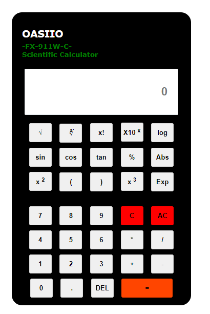

# Scientific-Calulator
A simple calculator using HTML, CSS & Javascript. This is a simple calculator functionality achieved using Javascript. The logic is very simple with the minimum lines of code possible.

# Technologies Used
HTML 
CSS 
JavaScript 

# Step to execute this calculator
1. Download the entire code. 
2. Open up in index.html.
